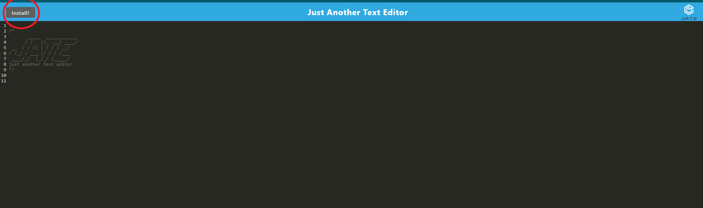
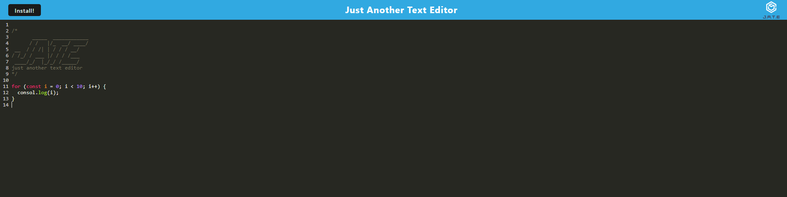
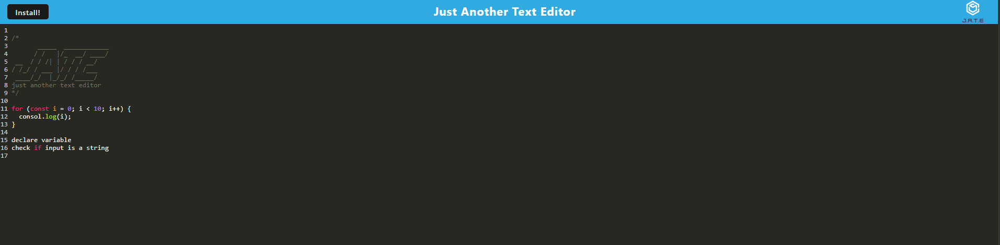

# PWA Text editor

## Description

This is just a simple text editor where the user can take notes. the good part of it is that it is progressive web application (PWA). It can be installed on devices and used in offline mode as well. It is particularly useful for those that prepare for interviews in the tech industry. It colour codes code snippets and adds indentation when writing a function. It is very helpful when one is trying pseudocoding. No need to comment out lines and the text is more readable with the indentations. 
This app can help others like me who are trying to sharpen their skills but not always have access to an IDE or when an idea pops up in their head and need to write it down quickly for later use. 
Building this application helped me to understand the purpose and usage of service workers and manifest. It allowed me to see how an application is turned into a PWA. 

## Table of Contents (Optional)

If your README is long, add a table of contents to make it easy for users to find what they need.

- [Installation](#installation)
- [Usage](#usage)
- [Links](#links)

## Installation

To install the application on a device it requires a chromium based browser such as Google Chrome, Microsoft Edge, or Opera. In any of these browsers clicking the `Install` button or the install icon in the address bar will install the application on the device. 

## Usage

## :trophy: Badges

  

## Links
  [My GitHub Profile](https://github.com/attila)  
  [Heroku](https://attilatexteditor-app.herokuapp.com/)
